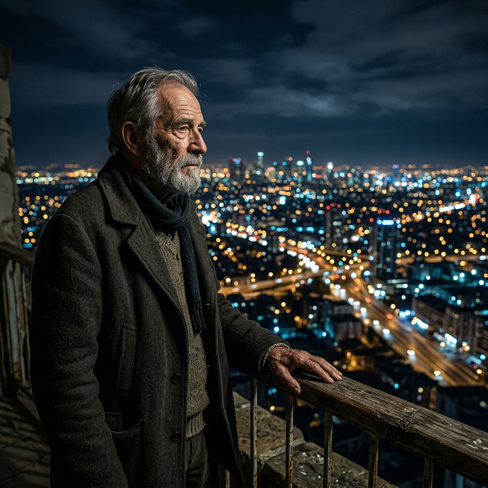
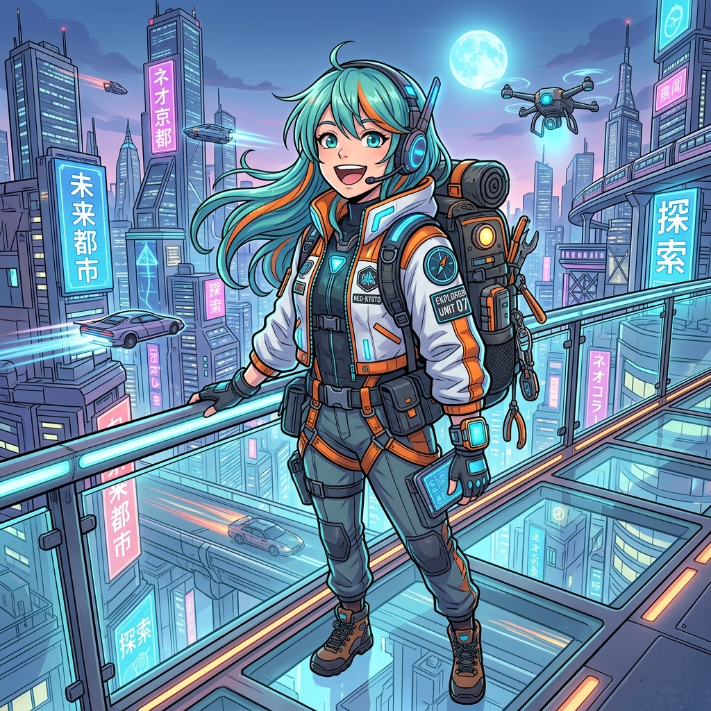
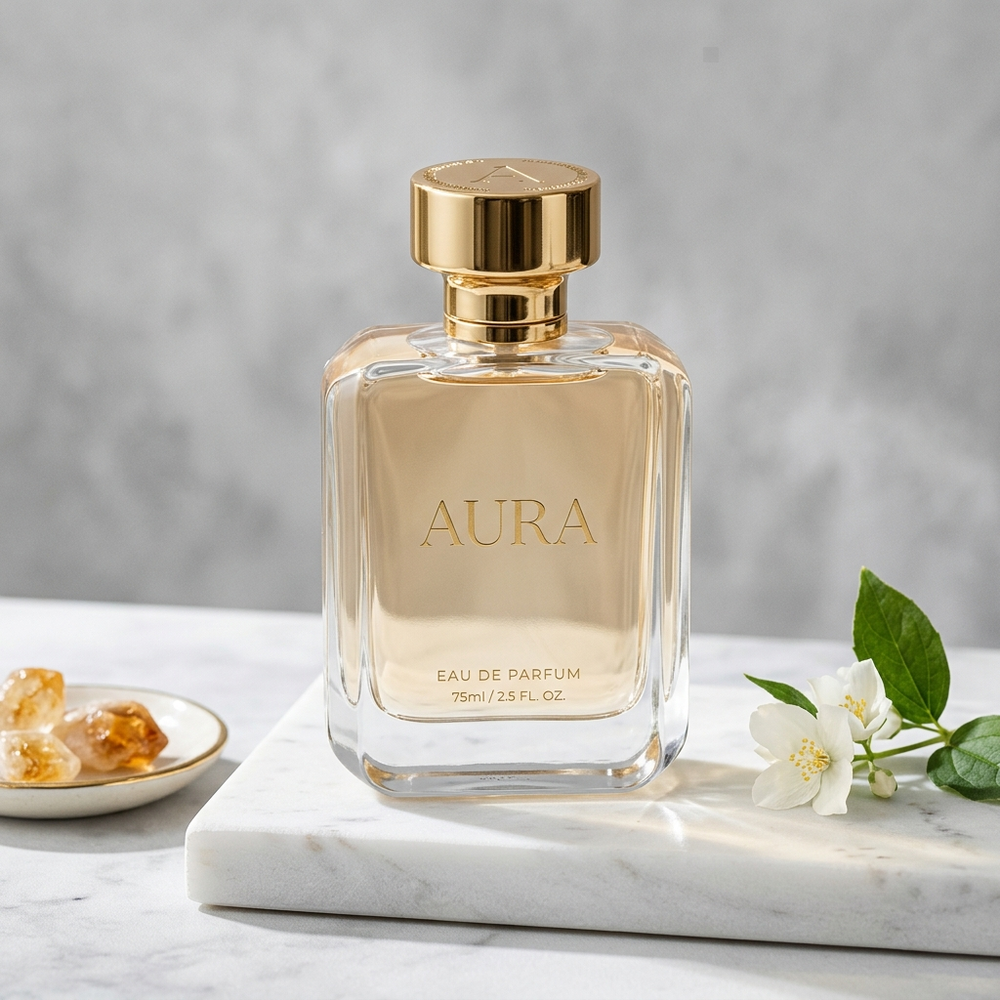
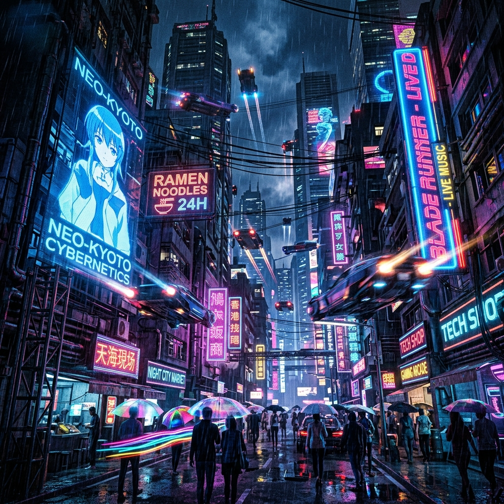
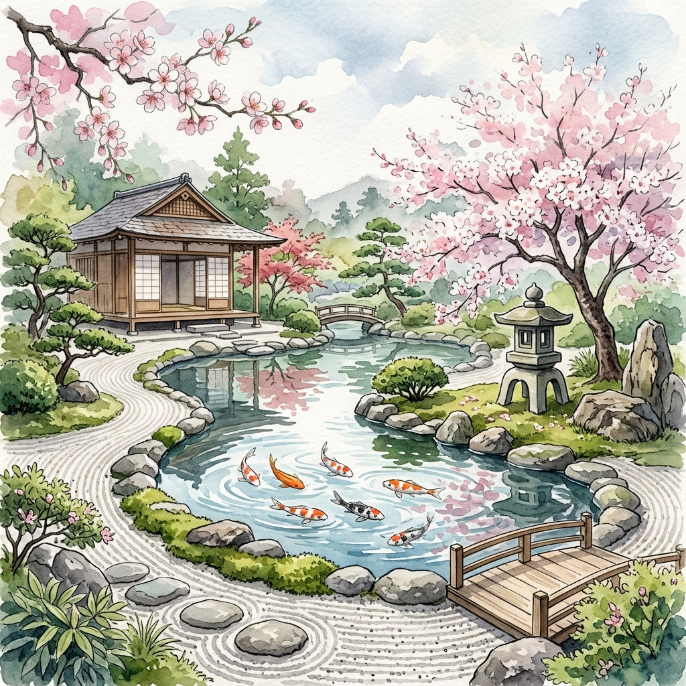
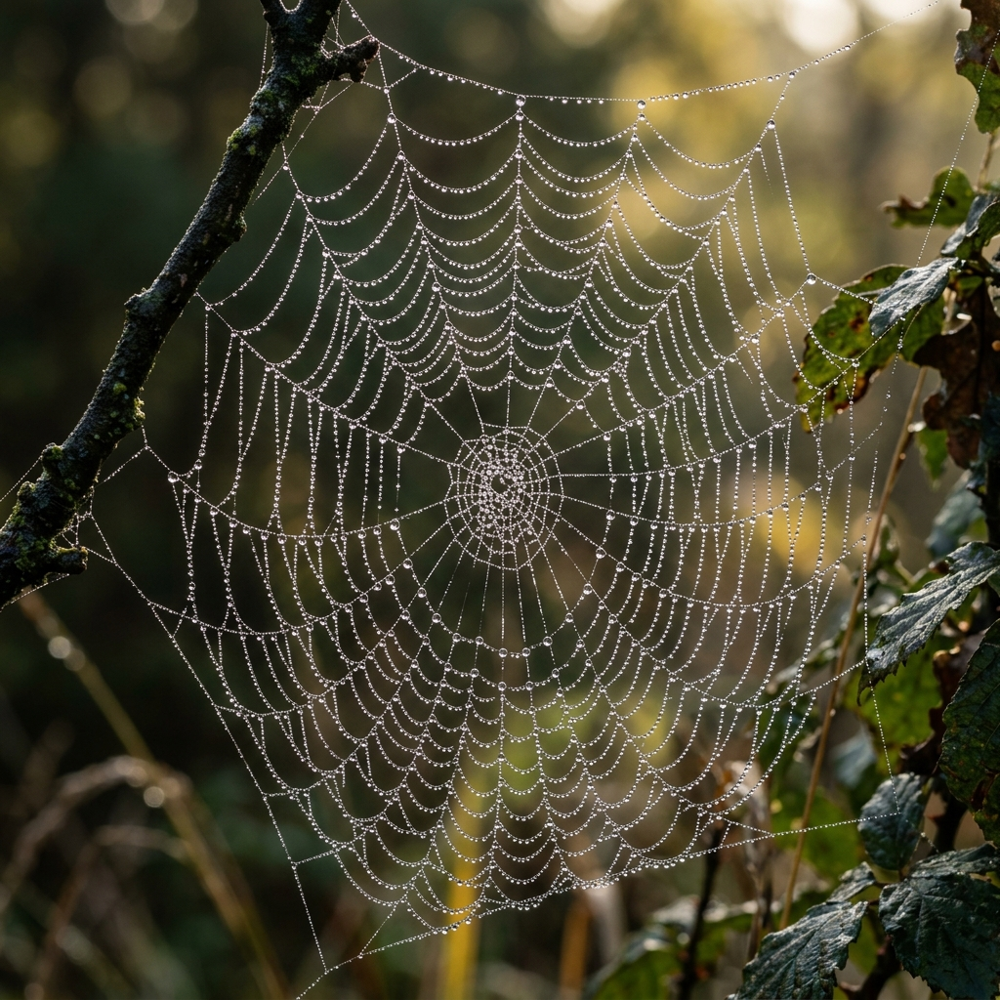
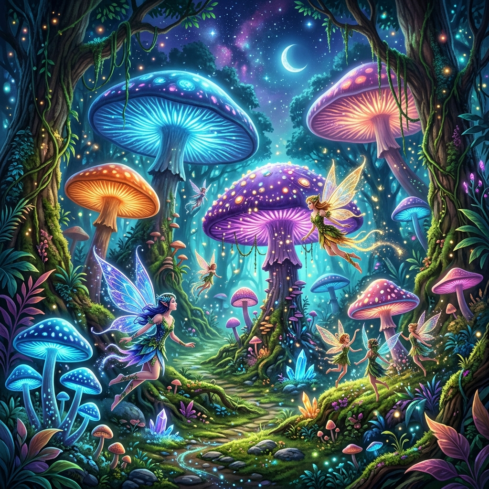
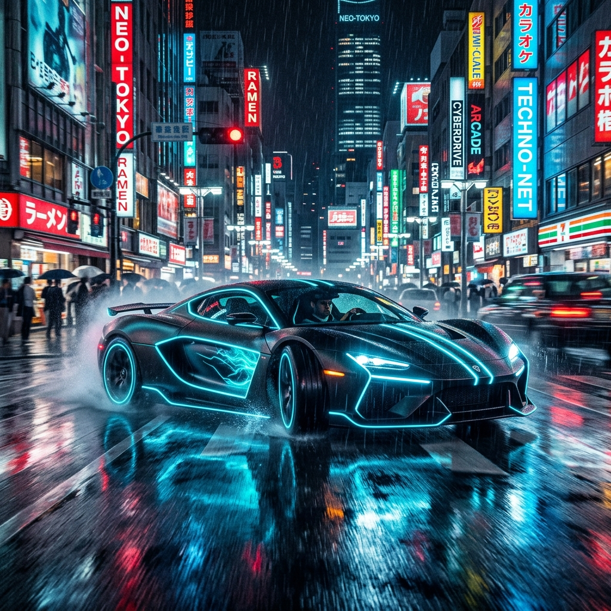

# Imaginex - Premium AI Image Generation Studio

### 🌟 Exclusive Advantages of Imaginex

- 🎯 **Say Goodbye to Tedious "Prompt Engineering":** Other tools require you to spend hours learning how to write complex prompts. With Imaginex, our **Action & Style Presets** system is deeply integrated behind the scenes. Just drop a basic idea, and the AI will automatically blend it with advanced photography, lighting, and cinematic parameters (Cinematic, Studio Lighting, Film Grain, etc.) to produce an absolute masterpiece.
- 🎛 **Studio-grade Workflow:** Say goodbye to cluttered chat interfaces and lost messages. We provide an independent, intuitive Control Panel. Adjust the Guidance scale, Seed, and aspect ratios in real-time, while cleanly managing your generation history (Session Gallery) with top-notch UI polish.
- ⚡ **Exceptional Generation Speed:** Powered by a global edge computing architecture (Cloudflare Workers AI), image rendering is extremely fast, almost completely eliminating latency regardless of your location.
- 🌍 **Flawless Bilingual Support:** Designed with a robust i18n structure, Imaginex natively supports both English and Vietnamese, allowing users to effortlessly convey their imagination without any language barriers.

## ✨ Core Features

- **Text-to-Image:** Generate entirely new images based on your pure ideas and text descriptions.
- **Image-to-Image:** Upload an existing photo and let the AI transform or redesign the composition according to new styles or specific requests.
- **Diverse Style Presets:** Support automatically applying a massive array of professional styles to your outputs, such as Cinematic, Photorealistic, Anime, Watercolor, Digital Art, Cyberpunk, and more.
- **Flexible Action Presets:**
  - Generate high-quality artistic character portraits (Portrait).
  - Create polished commercial product photography (Product shot).
  - Seamlessly transfer artistic formats (Style transfer).
  - Replace the background while flawlessly preserving the main subject (Background replace).
- **Extensive Customization:** Empowers users to fine-tune image dimensions (square, 9:16 portrait, 16:9 landscape... ), model adherence strength (Guidance scale), and Seed coefficients to ensure output consistency and stability.

## 🖼 Generated Image Examples

Here are some actual images generated directly by the tool using various configuration presets:

<table>
  <tr>
    <td width="50%">
      <b>1. Cinematic Style</b> 
      <i>Prompt: A photorealistic dramatic cinematic portrait of a wise old man looking at glowing city lights, filmic color grading, highly detailed.</i>  
      
    </td>
    <td width="50%">
      <b>2. Anime Style</b> 
      <i>Prompt: A beautiful vibrant anime style illustration of a futuristic city explorer, expressive face, clean line art.</i>  
      
    </td>
  </tr>
  <tr>
    <td width="50%">
      <b>3. Product Shot</b> 
      <i>Prompt: A sleek modern elegant perfume bottle, clean studio light, premium presentation, product shot styling.</i>  
      
    </td>
    <td width="50%">
      <b>4. Cyberpunk Style</b> 
      <i>Prompt: A futuristic neon-lit city street with glowing holograms and flying cars, raining, cyberpunk atmosphere, high contrast.</i>  
      
    </td>
  </tr>
  <tr>
    <td width="50%">
      <b>5. Watercolor Style</b> 
      <i>Prompt: A tranquil Japanese zen garden with a koi pond and cherry blossoms, soft lighting, watercolor wash, hand-painted feel.</i>  
      
    </td>
    <td width="50%">
      <b>6. Oil Painting Series</b> 
      <i>Prompt: A classical oil painting of a fierce naval battle in stormy seas, rich brushstrokes, dramatic lighting.</i>  
      
    </td>
  </tr>
  <tr>
    <td width="50%">
      <b>7. Natural Portrait / Skin Texture</b> 
      <i>Prompt: A flattering close-up portrait of a fantasy warrior queen, natural skin texture, balanced lighting, sharp facial detail.</i>  
      
    </td>
    <td width="50%">
      <b>8. Photorealistic Macro</b> 
      <i>Prompt: A photorealistic macro photograph of a spider web covered in morning dew drops, natural colors, ultra-detailed textures.</i>  
      
    </td>
  </tr>
  <tr>
    <td width="50%">
      <b>9. Fantasy Digital Art</b> 
      <i>Prompt: A glowing magical forest with giant mushrooms and fairies, epic digital art, polished illustration, crisp rendering.</i>  
      
    </td>
    <td width="50%">
      <b>10. Neon Drift</b> 
      <i>Prompt: A sleek futuristic sports car drifting through a rainy Tokyo street at night, neon glow, high contrast, luminous accents.</i>  
      
    </td>
  </tr>
</table>
